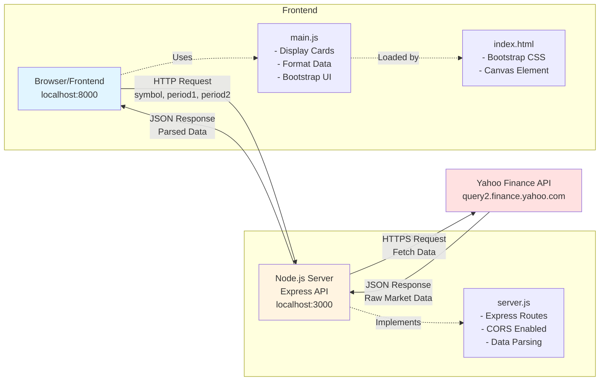

# Yahoo Finance - Granos

Aplicación web para visualizar datos de futuros de granos (Soja, Milho, Trigo) desde Yahoo Finance API.

## Requisitos

- Node.js (v18 o superior)
- Python 3 (para el servidor HTTP estático)

## Instalación

1. Clonar el repositorio:
```bash
git clone <url-del-repositorio>
cd copilot-cli-test
```

2. Instalar dependencias:
```bash
npm install
```

## Ejecución

El proyecto requiere dos servidores corriendo simultáneamente:

### 1. Servidor Node.js (API Backend)

En una terminal, ejecutar:
```bash
node server.js
```

El servidor API estará disponible en `http://localhost:3000`

### 2. Servidor HTTP estático (Frontend)

En otra terminal, ejecutar:
```bash
python3 -m http.server 8000
```

El frontend estará disponible en `http://localhost:8000`

## Uso

1. Abrir el navegador en `http://localhost:8000`
2. La aplicación mostrará tres columnas con datos de:
   - **Soja (ZS)**
   - **Milho (ZC)**
   - **Trigo (ZW)**
3. Cada tarjeta muestra:
   - Mes y año
   - Precio de apertura (/bushel)
   - Diferencia entre apertura y cierre (verde para positivo, rojo para negativo)

## API Endpoints

### GET /api/data

Obtiene datos históricos de futuros de granos.

**Parámetros de consulta:**
- `symbol` (opcional): Símbolo del grano (ZS, ZC, ZW). Default: `ZC`
- `period1` (opcional): Timestamp de inicio. Default: `1740077600`
- `period2` (opcional): Timestamp de fin. Default: `1761077420`

**Ejemplo:**
```
http://localhost:3000/api/data?symbol=ZS&period1=1740077600&period2=1761077420
```

## Tecnologías

- **Frontend**: HTML5, Bootstrap 5, Vanilla JavaScript
- **Backend**: Node.js, Express, CORS
- **API**: Yahoo Finance API

## Estructura del Proyecto

```
.
├── index.html          # Página principal
├── main.js            # Lógica del frontend
├── server.js          # Servidor API
├── package.json       # Dependencias del proyecto
└── README.md          # Este archivo
```

## Arquitectura



## Ramas

- `main`: Rama principal con código estable
- `dev`: Rama de desarrollo
